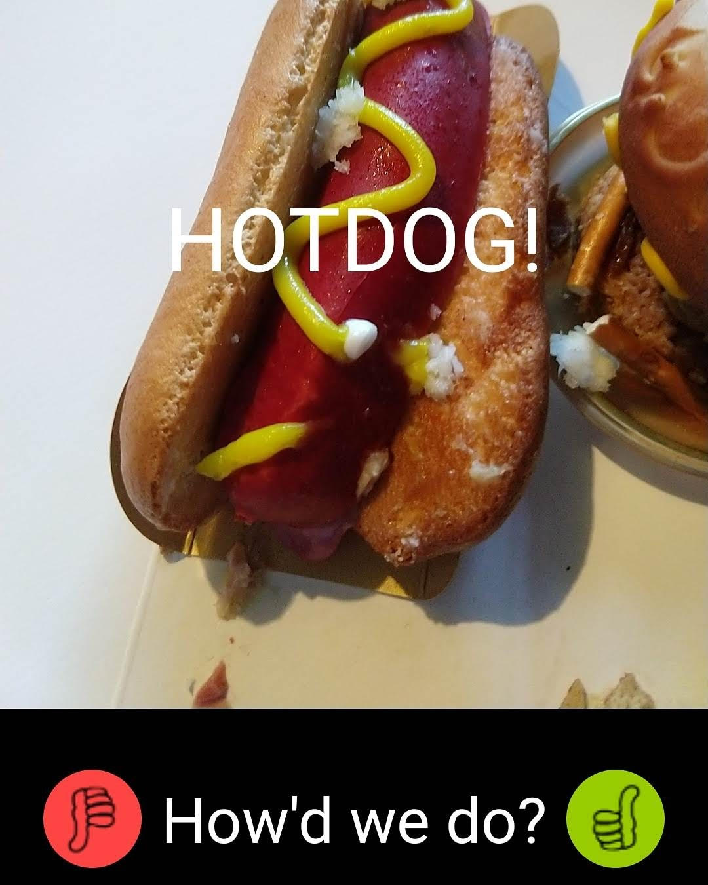

Hot-or-Notdog
===================================

Or: Yet Another Hotdog Detector

Inspired by the television program "Silicon Valley." Did you watch that episode and think to yourself, "Hey, I bet I could do that?" Well, I did.

The hot-or-not classifier is a Tensorflow Protobuf graph located in the assets folder (graph.pb). Users will need to supply their own classifiers until I can figure out a way to make the one I have small enough to upload to GitHub.

The app has a feature that lets users tell you whether the classifier got it right or wrong. The image and user input can be uploaded to a url specified in res/strings.xml. The user-uploaded images and labels can then be incorporated into the classifier.

Issues
------
Originally intended to be used with a Tensorflow graph.pb generated from [a python scipt](https://github.com/futonchild/hotdog_detector2). Unfortunately, the size of the generated graph is too large for the app to be made available on Play store and too large to be uploaded to GitHub. I have tried lots of things to bring down the size, but nothing has worked. Any help in this regard would be much appreciated.

Screenshot
----------

